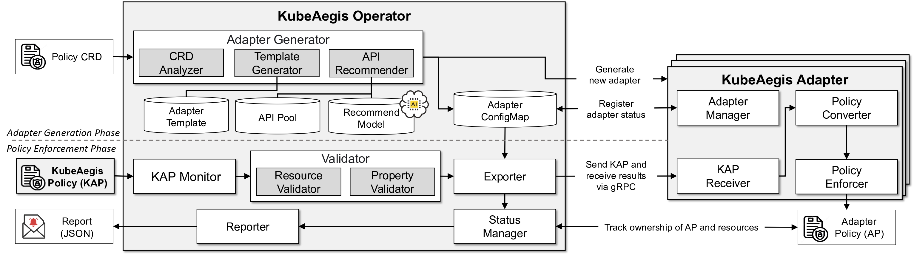

# KubeAegis



KubeAegis is a unified, adapter-based security policy management system for Kubernetes clusters. It manages network, system, and cluster-level security policies in a centralized manner and enables consistent policy enforcement through validation and tracking.

> This project was presented at **IEEE Access (2024)** as 
**"KubeAegis: A Unified Security Policy Management Framework for Containerized Environments".**


## ✨ Key Features
> This system currently supports Cilium, Calico, KubeArmor, Tetragon, and Kyverno, and can be extended via automatic adapter generation using SRoBERTa-based API recommendation.
- **Unified Policy Format (KAP)**: Write one policy to enforce across multiple engines.

- **Adapter-Based Enforcement**: Supports security tools like Cilium, Calico, KubeArmor, Kyverno, and Tetragon.

- **Real-Time Validation**: Pre-checks both resource and property before applying policies.

- **Ownership Tracking**: Automatically updates policy status when target resources are changed or deleted.

- **Plug-and-Play Adapter Creation**: Generate adapter templates with one command (make adapter).


## 🚀 Getting Started

### Prerequisites

| Component         | Required Version                         |
|------------------|-------------------------------------------|
| Kubernetes        | v1.20+ (recommended v1.30+)              |
| Go (Golang)       | v1.24.2+                                 |
| Container Runtime | containerd                 |
| CNI Plugin        | One of: Cilium, Calico                   |
| System Security   | KubeArmor, Tetragon              |
| Cluster Policy    | Kyverno (required for cluster-level rules) |
> ⚠️ At least one tool from each category (CNI, System, Cluster) must be installed.
 
### 🧪 Sample Application Setup
Deploy a reference microservice app: 
- Google Cloud's [Online Boutique](https://github.com/GoogleCloudPlatform/microservices-demo)
- Istio's [Bookinfo Application](https://github.com/istio/istio/blob/master/samples/bookinfo/README.md)
- Cisco's [Martian Bank](https://github.com/cisco-open/martian-bank-demo)

For Example, 
```
$ git clone https://github.com/GoogleCloudPlatform/microservices-demo.git
$ cd microservices-demo/release
$ kubectl apply -f kubernetes-manifests.yaml
$ kubectl get pod
NAME                                     READY   STATUS    RESTARTS   AGE
adservice-5b575d9444-plvfq               1/1     Running   0          2m32s
cartservice-7f7b9fc469-k4sx6             1/1     Running   0          2m33s
checkoutservice-6bbccb4788-cw66j         1/1     Running   0          2m33s
currencyservice-795445fcb8-84czn         1/1     Running   0          2m32s
emailservice-c498b5f8b-6hkwb             1/1     Running   0          2m33s
frontend-548c468bb9-m6vmc                1/1     Running   0          2m33s
...
```

### 📜 KubeAegisPolicy Specification 
The full YAML schema for `KubeAegisPolicy` (KAP) is available in [`docs/spec-kap.md`](./docs/spec-kap.md).

The spec includes:
- Unified fields for network, system, and cluster types.
- CEL-based selectors and action definitions.
- Low-level actionPoint configurations for file access, syscall tracing, HTTP rules, and more.


### 🧩 Adapter Extension & Recommendation System  
KubeAegis ships with an **adapter-maker** that analyzes any CRD, recommends the best‐fit conversion APIs with a fine-tuned **SRoBERTa** model, and generates a runnable adapter scaffold.

1. Generate a new adapter

Example: create a Calico adapter from its CRD
```bash
$ make adapter NAME=calico CRD=./crds/calico_network_policy_crd.json
```
Output highlights
```
✓ CRD Information:
  - Group: crd.projectcalico.org, Kind: NetworkPolicy, Version: v1
✓ Adapter created successfully.
✓ Recommended APIs for each field:
  - CreateHTTPRules: [.spec.ingress.http]
  - CreateDestinationSelector: [.spec.egress.to]
  ...
```
The scaffold appears under pkg/adapter/kubeaegis-calico/ with its own Makefile (build, run, docker-build, …).

2. Updating the Adapter ConfigMap

When a new adapter is registered using the make adapter command, KubeAegis automatically inserts a corresponding entry into the global adapter-config ConfigMap. This includes:
- A default address (e.g., `localhost:50055`)
- An empty placeholder for `supportedTypes`
- Initial status as `offline`

For Example (truncated)::
```
"adapter-name": {
  "supportedTypes": {
    "": [""]
  },
  "address": "localhost:50055",
  "status": "offline"
}
```
> ✅ You only need to fill in the supportedTypes field manually.
Everything else is handled automatically by the system.

Here’s a complete example:
```
"kubeaegis-calico": {
  "supportedTypes": {
    "network": ["endpoint", "entities", "port", "cidr"]
  },
  "address": "localhost:50055",
  "status": "offline"
}
```
This informs the KubeAegis operator of which types of policies the adapter supports, allowing proper routing and validation of `KubeAegisPolicy` resources.

### 🔄 Running KubeTeus
> KubeAegis consists of two main components:
> - Main Operator
> - Adapters for each enforcement system (e.g.,kubeaegis-cilium, kubeaegis-kubearmor, etc.)

1. Apply / Update adapter configuration
```
$ kubectl apply -f pkg/exporter/adapterconfig.yaml
```

2. Start the Main Operator

This starts the operator that monitors and validates KubeAegisPolicy (KAP) resources, automatically dispatching them to the appropriate adapters.

```
$ make generate      # code-gen (one-time)
$ make install       # CRDs + RBAC
$ make run           # start operator locally
/home/cclab/KubeAegis/bin/controller-gen rbac:roleName=manager-role crd webhook paths="./api/v1/..." output:crd:artifacts:config=config/crd/bases
/home/cclab/KubeAegis/bin/controller-gen object:headerFile="hack/boilerplate.go.txt" paths="./api/v1/..."
go fmt ./...
go vet ./...
go run ./cmd/main.go
2025-xx-xxTxx:xx:xxZ    INFO    setup   starting manager
2025-xx-xxTxx:xx:xxZ    INFO    starting server {"name": "health probe", "addr": "[::]:8081"}
2025-xx-xxTxx:xx:xxZ    INFO    Starting EventSource    {"controller": "kubeaegispolicy", "controllerGroup": "cclab.kubeaegis.com", "controllerKind": "KubeAegisPolicy", "source": "kind source: *v1.KubeAegisPolicy"}
2025-xx-xxTxx:xx:xxZ    INFO    Starting Controller     {"controller": "kubeaegispolicy", "controllerGroup": "cclab.kubeaegis.com", "controllerKind": "KubeAegisPolicy"}
2025-xx-xxTxx:xx:xxZ    INFO    Starting workers        {"controller": "kubeaegispolicy", "controllerGroup": "cclab.kubeaegis.com", "controllerKind": "KubeAegisPolicy", "worker count": 1}
```
Confirm policy deployment:
```
$ kubectl get crds | grep kubeaegis
kubeaegispolicies.cclab.kubeaegis.com             2025-xx-xxTxx:xx:xxZ
policyreports.cclab.kubeaegis.com                 2025-xx-xxTxx:xx:xxZ
```

2. Launch adapters

🧩 Adapters Available:
- pkg/adapter/kubeaegis-cilium or kubeaegis-calico
- pkg/adapter/kubeaegis-kubearmor
- pkg/adapter/kubeaegis-tetragon
- pkg/adapter/kubeaegis-kyverno

```
$ cd pkg/adapter/kubeaegis-cilium
$ make run
{"level":"info","ts":"2025-xx-xxTxx:xx:xxZ","logger":"main","msg":"Cilium adapter started"}
{"level":"info","ts":"2025-xx-xxTxx:xx:xxZ","logger":"main","msg":"Adapter status updated","adapterName":"kubeaegis-cilium","status":"online"}
{"level":"info","ts":"2025-xx-xxTxx:xx:xxZ","logger":"main","msg":"gRPC server listening on port 50052"}
```
> Each adapter reports its status to the operator and flips from offline → online in the ConfigMap.

### 🔒 Verifying KubeAegisPolicy with Cilium on Port 8080
> This section demonstrates how the `KubeAegisPolicy` correctly blocks pod-to-pod communication on TCP port **8080**, using `Cilium` as the enforcing backend.

#### 🚀 Deploy a Client Pod
> [examples/pods/test-nginx.yaml](examples/pods/test-nginx.yaml)
```
apiVersion: v1
kind: Pod
metadata:
  name: nginx
  labels:
    app: nginx
spec:
  containers:
    - image: nginx
      name: nginx
      ports:
        - containerPort: 8080
```
Apply it:
```
$ kubectl apply -f examples/pods/test-nginx.yaml
```

#### 🧪 Step 1: Pod-to-Pod Communication Check (Before Policy)
1. Get the Pod IPs
```
$ kubectl get pod -o wide
NAME                                     READY   STATUS    RESTARTS   AGE     IP            NODE     ...
frontend-64c5865856-qvplw                1/1     Running   0          7m17s   10.0.0.117   master
nginx                                    1/1     Running   0          78s     10.0.0.50    master
```

2. Verify connectivity from nginx to frontend:8080
```
$ kubectl exec -it nginx -- curl http://10.0.0.117:8080

<!DOCTYPE html>
<html lang="en">
<head>
    ...
    <title>Online Boutique</title>
</head>
...

```
> ✅ You should see a valid HTTP response before the policy is applied.

#### 🧪 Step 2: Apply KubeAegisPolicy to Block Port 8080
> [examples/network/kap-cel-block-port-8080.yaml](examples/network/kap-cel-block-port-8080.yaml)
```
apiVersion: cclab.kubeaegis.com/v1
kind: KubeAegisPolicy
metadata:
  name: kap-block-port
spec:
  intentRequest:
    - type: network
      selector:
        cel:
          - labels["app"] == "nginx"
      rule:
        action: Block
        to:
          - kind: port
            port: "8080"
            protocol: TCP
```
Apply it:
```
$ kubectl apply -f examples/network/kap-cel-block-port-8080.yaml
```

#### 🧪 Step 3: Policy Propagation Logs

KubeAegis Operator Logs: 
```
2025-xx-xxT13:51:47Z    INFO    KubeAegis found {"controller": "kubeaegispolicy", "controllerGroup": "cclab.kubeaegis.com", "controllerKind": "KubeAegisPolicy", "KubeAegisPolicy": {"name":"kap-block-port","namespace":"default"}, "namespace": "default", "name": "kap-block-port", "reconcileID": "876060ab-fcc1-4815-a084-d9c1472546a0", "KubeAegis.Name": "kap-block-port", "KubeAegis.Namespace": "default"}
2025-xx-xxT13:51:47Z    INFO    Step 1: Check for the existence of a resource      {"controller": "kubeaegispolicy", "controllerGroup": "cclab.kubeaegis.com", "controllerKind": "KubeAegisPolicy", "KubeAegisPolicy": {"name":"kap-block-port","namespace":"default"}, "namespace": "default", "name": "kap-block-port", "reconcileID": "876060ab-fcc1-4815-a084-d9c1472546a0"}
2025-xx-xxT13:51:47Z    INFO    Step 2: Check resource status and properties       {"controller": "kubeaegispolicy", "controllerGroup": "cclab.kubeaegis.com", "controllerKind": "KubeAegisPolicy", "KubeAegisPolicy": {"name":"kap-block-port","namespace":"default"}, "namespace": "default", "name": "kap-block-port", "reconcileID": "876060ab-fcc1-4815-a084-d9c1472546a0"}
2025-xx-xxT13:51:47Z    INFO    KubeAegis verified{"controller": "kubeaegispolicy", "controllerGroup": "cclab.kubeaegis.com", "controllerKind": "KubeAegisPolicy", "KubeAegisPolicy": {"name":"kap-block-port","namespace":"default"}, "namespace": "default", "name": "kap-block-port", "reconcileID": "876060ab-fcc1-4815-a084-d9c1472546a0", "validationErrors count": 0}
2025-xx-xxT13:51:47Z    INFO    Adapter found   {"controller": "kubeaegispolicy", "controllerGroup": "cclab.kubeaegis.com", "controllerKind": "KubeAegisPolicy", "KubeAegisPolicy": {"name":"kap-block-port","namespace":"default"}, "namespace": "default", "name": "kap-block-port", "reconcileID": "876060ab-fcc1-4815-a084-d9c1472546a0", "Adapter.Name": ["kubeaegis-cilium"]}
2025-xx-xxT13:51:48Z    INFO    Policy dispatched to adapter       {"controller": "kubeaegispolicy", "controllerGroup": "cclab.kubeaegis.com", "controllerKind": "KubeAegisPolicy", "KubeAegisPolicy": {"name":"kap-block-port","namespace":"default"}, "namespace": "default", "name": "kap-block-port", "reconcileID": "876060ab-fcc1-4815-a084-d9c1472546a0", "Adapter.Name": "kubeaegis-cilium"}
```

Cilium Adapter Logs: 
```
{"level":"info","ts":"2025-xx-xxT13:51:48Z","logger":"main","msg":"KubeAegis arrived","KubeAegis.Name":"kap-block-port","KubeAegis.Namespace":"default"}
{"level":"info","ts":"2025-xx-xxT13:51:48Z","logger":"main","msg":"KubeAegisPolicy fetched","KubeAegis.Name":"kap-block-port","KubeAegis.Namespace":"default"}
{"level":"info","ts":"2025-xx-xxT13:51:48Z","logger":"main","msg":"CiliumNetworkPolicy started to transfer"}
{"level":"info","ts":"2025-xx-xxT13:51:48Z","logger":"main","msg":"CiliumPolicy converted"}
{"level":"info","ts":"2025-xx-xxT13:51:48Z","logger":"main","msg":"CiliumNetworkPolicy enforced","Cilium.Name":"cnp-kap-block-port","Cilium.Namespace":"default"}
```

Check KAP and CNP:
```
$ kubectl get kap -o wide
NAME             STATUS    AGE   POLICIES                 NUMBER OF APS 
kap-block-port   Created   58s   ["cnp-kap-block-port"]   1       

$ kubectl get cnp -o wide
NAME                 AGE
cnp-kap-block-port   94s
```

```
$ kubectl get cnp cnp-kap-block-port -o yaml
apiVersion: cilium.io/v2
kind: CiliumNetworkPolicy
metadata:
  creationTimestamp: "2025-xx-xxT13:51:48Z"
  generation: 1
  name: cnp-kap-block-port
  namespace: default
  ownerReferences:
  - apiVersion: cclab.kubeaegis.com/v1
    kind: KubeAegisPolicy
    name: kap-block-port
    uid: 3a07f298-1c21-4bce-b5bf-18f94eae244e
  resourceVersion: "45236002"
  uid: 1ceaf5f5-1f8c-4950-a6e9-c1302df3c36f
spec:
  egressDeny:
  - toPorts:
    - ports:
      - port: "8080"
        protocol: TCP
  endpointSelector:
    matchLabels:
      any:app: nginx
status:
  conditions:
  - lastTransitionTime: "2025-xx-xxT13:51:48Z"
    message: Policy validation succeeded
    status: "True"
    type: Valid
```

#### 🧪 Step 4: Test Blocked Communication
Try again from nginx to frontend:8080:
```
$ kubectl exec -it nginx -- curl http://10.0.0.117:8080
curl: (28) Failed to connect to 10.0.0.117 port 8080 after 133468 ms: Couldn't connect to server
command terminated with exit code 28
```
→ This should hang or fail (connection timeout / refused)


### Cleanup

Delete the policy:
```
$ kubectl delete -f examples/network/kap-cel-block-port-8080.yaml
kubeaegispolicy.cclab.kubeaegis.com "kap-block-port" deleted
```

Confirm deletion:
```
$ kubectl get kap
No resources found in default namespace.

$ kubectl get cnp
No resources found in default namespace.
```

Operator Logs:
```
2025-xx-xxT13:55:57Z    INFO    KubeAegis not found. Ignoring since object must be deleted {"controller": "kubeaegispolicy", "controllerGroup": "cclab.kubeaegis.com", "controllerKind": "KubeAegisPolicy", "KubeAegisPolicy": {"name":"kap-block-port","namespace":"default"}, "namespace": "default", "name": "kap-block-port", "reconcileID": "7138a695-3406-4951-8c54-b586de60730b"}
```

Cilium Adapter Logs: 
```
{"level":"info","ts":"2025-xx-xxT13:55:57Z","logger":"main","msg":"CiliumPolicy deleted","cilium.Name":"ksp-kap-block-port","cilium.Namespace":"default"}
```


## License

Copyright 2025.

Licensed under the Apache License, Version 2.0 (the "License");
you may not use this file except in compliance with the License.
You may obtain a copy of the License at

    http://www.apache.org/licenses/LICENSE-2.0

Unless required by applicable law or agreed to in writing, software
distributed under the License is distributed on an "AS IS" BASIS,
WITHOUT WARRANTIES OR CONDITIONS OF ANY KIND, either express or implied.
See the License for the specific language governing permissions and
limitations under the License.


